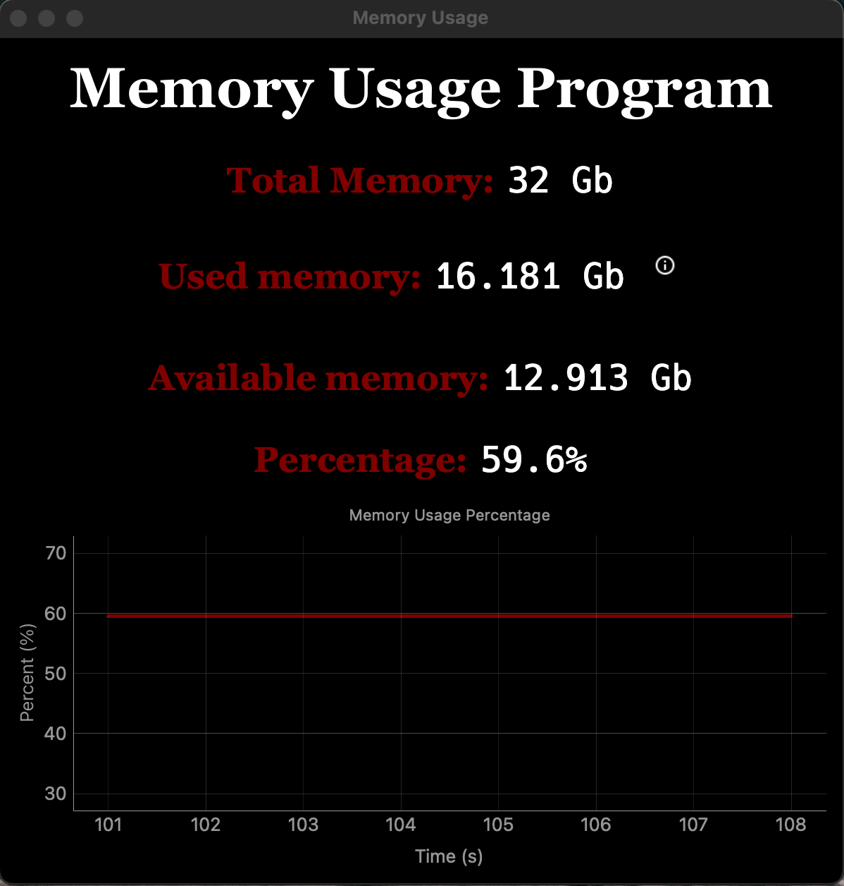

# Random Access Memory Usage Tracker Program

## **Program overview**

Application wrote on **PySide6** using **psutil** for tracking usage of memory.

It contains values of Total Memory, Used memory, Available memory(which can be used right away, so it's don't linked to any processes) and Percantage of memory load.

It has a live graph, which draw percentage of memory usage and updates each second.

> Currently available on English and built for MacOS.

---
## **Screenshot of program**

